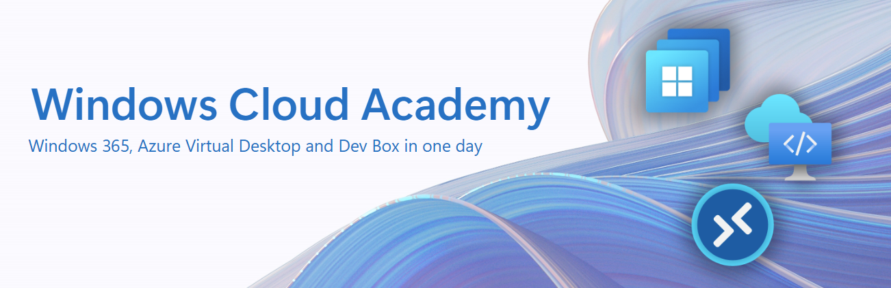
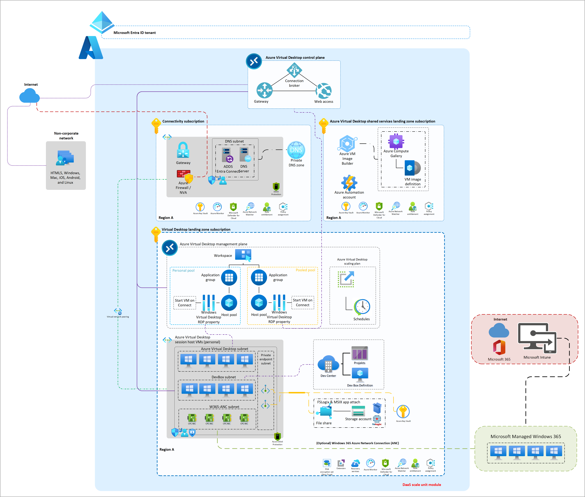

# Windows Cloud Academy

The Winodws Cloud Academy is designed to help you get hands-on experience with Windows 365 (W365) and Azure Virtual Desktop (AVD). 

W365 - is a cloud-based service that automatically provisions Cloud PCs—dedicated Windows devices assigned to individual users. It combines the productivity, security, and collaboration features of Microsoft 365 with the flexibility of the cloud.

AVD – is a fully cloud-native Desktop-as-a-Service (DaaS) platform. It includes built-in infrastructure components like brokering, web access, load balancing, management, and monitoring—all configurable via the Azure portal, ARM templates, Bicep, or Terraform.

## Learning objectives 

By the end of this Academy, you'll be able to:

- Choose the right virtual desktop solution for your needs.
- Set up and manage Windows 365 Cloud PCs and AVD environments using Microsoft tools.
- Configure Intune device policies, manage RDP properties, and deploy applications.

## Requirements

- Basic Azure knowledge [(Azure fundamentals)](https://learn.microsoft.com/en-us/training/paths/azure-fundamentals-describe-azure-architecture-services/)
- Basic Intune knowledge [(Microsoft Intune fundamentals)](https://learn.microsoft.com/en-us/training/paths/endpoint-manager-fundamentals/)

## Agenda

1.	Welcome
2.	Introduction - Windows 365 and Azure Virtual Desktop
3. Getting started with Azure Virtual Desktop
4.	Getting started with Windows 365
5.	Q&A

## Rules

 1. Do not abuse the power of Admin Rights to sabotage or manipulate other attendees and their resources.
 2. You will receive your Admin & User credentials personally, take good care of it.
 3. Please name all your resources with **PUNK[count]**, e.g. PUNK1. 
 
 ## The environment
 
 This is the W365 & AVD Windows Cloud Academy Architecture:
 
 
 
 ## Credentials
 
 You will receive your Admin & User credential personally and take good care of it.
 
 ## Access Windows Cloud Solutions
 
 - [Webclient](https://windows.cloud.microsoft/)
 - [Windows App (store)](https://apps.microsoft.com/detail/9N1F85V9T8BN) or [Windows App (offline installer)](https://go.microsoft.com/fwlink/?linkid=2262633)

 ## Challenges
 
 ### Azure Virtual Desktop
 
 - Challenge 1: **[Create a host pool for multi-session desktops](Challenges/AVD/01-AVD-Multi-Session-Hostpool.md)**
 - Challenge 2: **[Configure RDP Properties](Challenges/AVD/02-AVD-RDP-Properties.md)**
 - Challenge 3: **[Enable FSLogix Profile Container](Challenges/AVD/03-AVD-FSLogix.md)**
 
 ### Windows 365
 
 - Challenge 1: **[Provisioning a Cloud PC](Challenges/W365/01-W365-Provisioning-CPC.md)**
 - Challenge 2: **[Configure RDP Properties](Challenges/W365/02-W365-RDP-Properties.md)**
 - Challenge 3: **[Deploy application via Intune](Challenges/W365/03-W365-App-Deployment.md)**

## Contributor

- [Ben Martin Baur](https://www.linkedin.com/in/ben-martin-baur/)
- [Daniel Weppeler](https://www.linkedin.com/in/daniel-weppeler/)

Engineered and powered by [avdpunks.com](https://avdpunks.com)

