# Solutionguide 3: Enable AVD Insights

## Challenge 
Create a **Log Analytics Workspace** to collect all monitoring data for your Resource Group.

Open the **AVD Insights configuration workbook** from your existing host pool and enable monitoring data collection.

## Success Criteria

- AVD Insights is enabled and displays monitoring data from both the AVD control plane and AVD session hosts.
- Network latency and user login attempts are visible within the AVD Insight dashboard.

## Step 1 - Create Log Analytics workspace

1.  Sign in to the [Azure Portal](https://portal.azure.com/).

2.  Search for **Log Analytics workspaces** and select it from the list.

3.  Click **+ Create** to create a new Log Analytics workpsace 

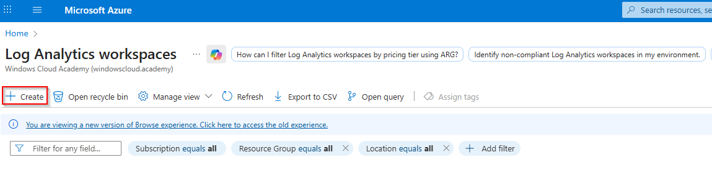

4.  On the Basics page, refer to the following screenshot to fill in the required fields. Select your Subscription, Resource Group and define a Log Analytics workspace name. As Location choose **North Europe**. 

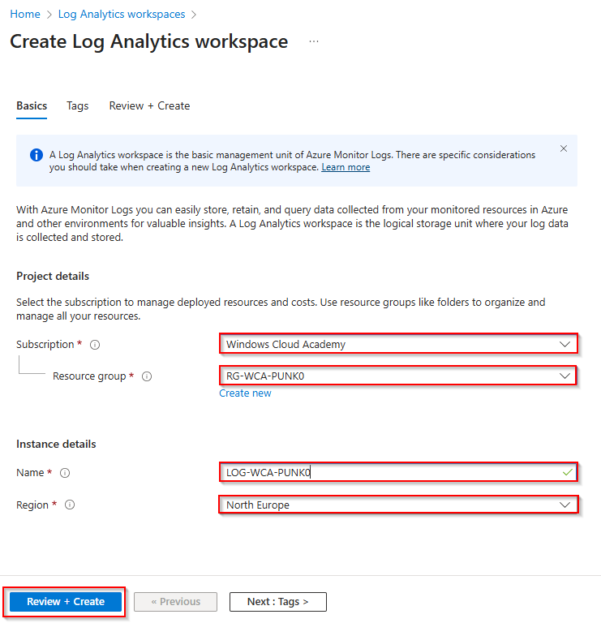

Then click **Review + Create** and, after successful validation, click **Create** again. 

You cannot proceed until the Log Analytics Workspace has been created.

## Step 2 - Enable AVD Insights for your host pool

1.  Sign in to the [Azure Portal](https://portal.azure.com/).

2.  Search for **Azure Virtual Desktop** and select it from the list.

3.  Under Manage, select **Host pools** and select **Your AVD host pool**.

4.  Under **Monitoring**, select the **Insights** option. 

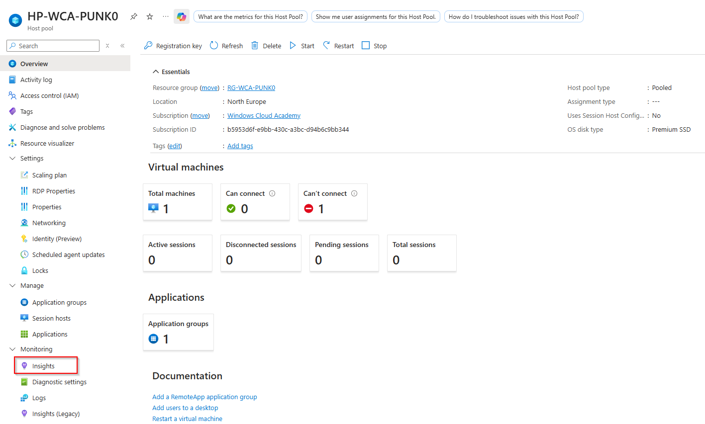

5. You should now see the information that Azure Monitor is not configured. Then open the **configuration workbook** to configure AVD Insights. 

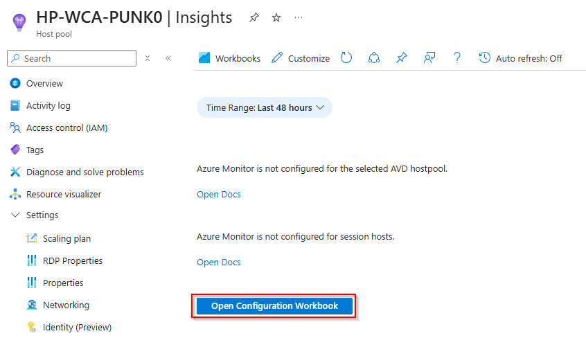

6. Next, select your previously created Log Analytics workspace from the list, then run the **Configure Host Pool** and **Configure Workspace** deployments. Wait a few minutes until the deployments are successfully completed. 

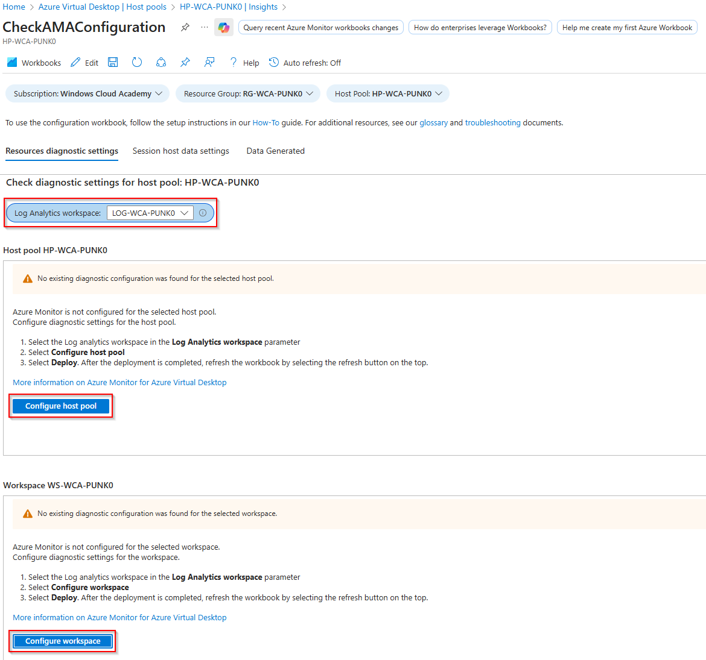

7. Click the **Refresh** button in the configuration workbook, several times if necessary. 

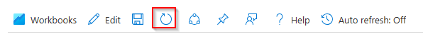

8. Check the activation for your host pool and workspace. If you see **two green YES**, open the **Session Host Data Settings** tab to configure your AVD session host.

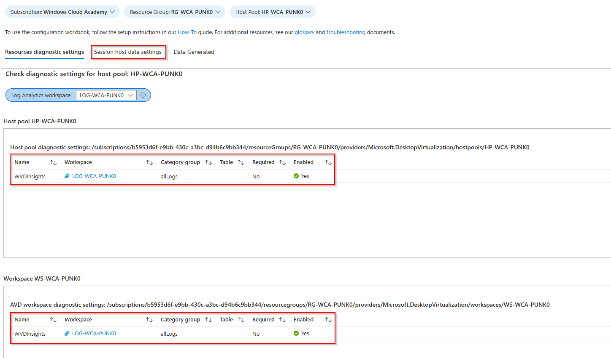

9. Select your **Log Analytics workspace** from the list and also verify that the right **DCR (Data Collection Rule) resource group** is selected. For the Session host data, a data collection rule is necessary.

Click **Create data collection rule** and wait a few minutes until the deployments are successfully completed. 

> **Note:** You may see other DCR (Data Collection Rule) participants here, but you should create your own in your resource group. 

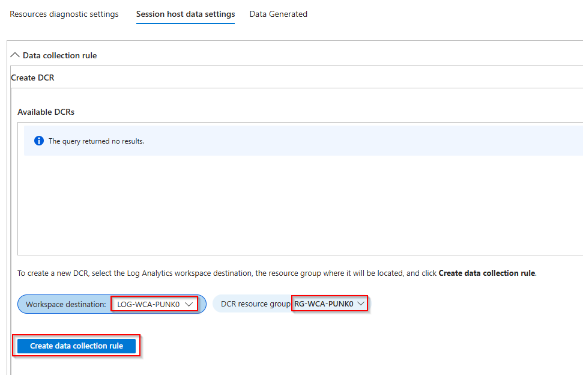

10. Click the **Refresh** button again, then select your **DCR** from the list.

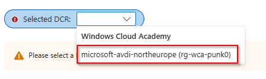

11. Next, perform two deployments, one for the DCR associations **Deploy Association** and the second for the Azure Monitor Agent extension **Add extension**. 

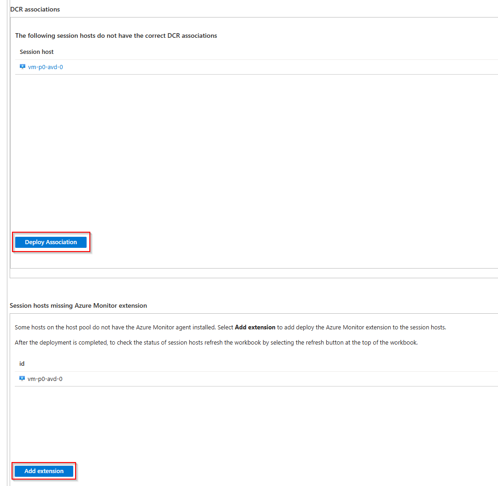

12. Click the **Refresh** button again and check that all information messages are displayed in green. If so, your AVD Insight has been successfully configured.

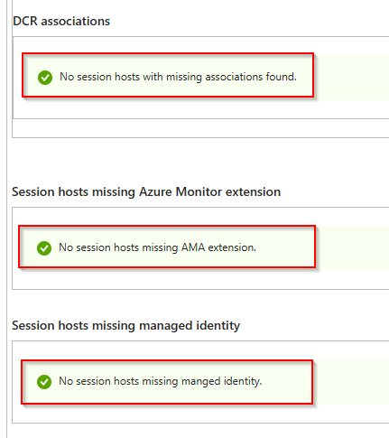

13. Under the **Data Generated** tab, you can see how much monitoring data has been collected currently or in the past. 

> **Note:** To generate some monitoring data, you must log in and out of the AVD session several times. 

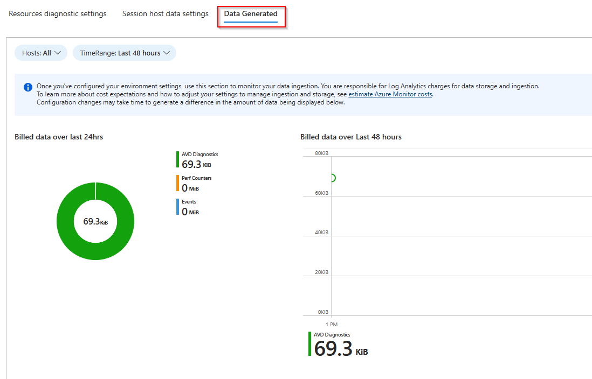

## Step 3 - View AVD Insights Data

1.  Sign in to the [Azure Portal](https://portal.azure.com/).

2.  Search for **Azure Virtual Desktop** and select it from the list.

3.  Under Manage, select **Host pools** and select **Your AVD host pool**.

4.  Under **Monitoring**, select the **Insights** option. You should now see several tabs and monitoring data for your AVD session hosts and user sessions.

> **Note:** When you open **Insights** from the general AVD management window, you will see the entire AVD environment and all AVD host pools. 

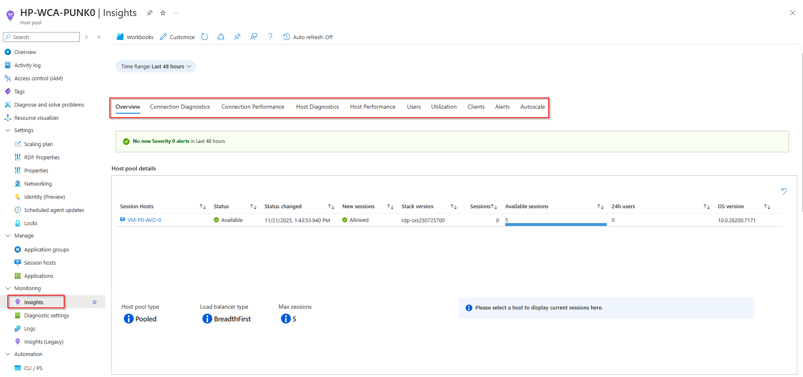

5. Try to find out what you can find in all these monitoring tabs.