# Solutionguide 4: Deploy Windows 365 Frontline Shared Desktop or Cloud Apps

## Challenge

In this challenge, you can choose to deploy your single Windows 365 Frontline license either in **dedicated desktop mode** or in **cloud apps mode**. 

Each participant has **only one** Windows 365 Frontline license available, so decide which option you would like to test:

### Option 1 - Windows 365 Frontline Shared in dedicated Desktop mode

- Create a provisioning policy
- Experience: **Full Cloud PC desktop**
- License type: **Frontline**
- Frontline type: **Shared**
- Your cloud PC should be set up to use **Microsoft Hosted Networks** and only supports **Microsoft Entra Join** for identity and access.
- Region: **North Europe**
- **Make sure your Cloud PC has a custom name that is not the default, for example: CPC-P1-%RAND:5%"**
- Assign your user group, but ensure the number of Cloud PCs is set to **one**.

### Option 2 - Windows 365 Frontline Shared in Cloud Apps mode

- Create a provisioning policy
- Experience: **Cloud Apps**
- License type: **Frontline**
- Frontline type: **Shared**
- Your cloud PC should be set up to use **Microsoft Hosted Networks** and only supports **Microsoft Entra Join** for identity and access.
- Region: **North Europe**
- **Make sure your Cloud PC has a custom name that is not the default, for example: CPC-P1-%RAND:5%"**
- Assign your user group, but ensure the number of Cloud PCs is set to **one**.

## Success Criteria

### Option 1 - Windows 365 Frontline Shared in dedicated Desktop mode
- Your Cloud PC in dedicated desktop mode is now available, and you can log in.
- You will receive a new user profile each time you sign in.

### Option 2 - Windows 365 Frontline Shared in Cloud Apps mode
- Your Cloud PC in Cloud Apps mode is now available, and you have published example apps such as Word and Notepad.
- You can log in and start using a Cloud app.

## Solutionguide: Option 1 - Windows 365 Frontline Shared in dedicated Desktop mode

1.  Sign in to the [Microsoft Intune](https://intune.microsoft.com/) and navigate to **Devices** then **Windows 365** to access the Windows 365 management panel.

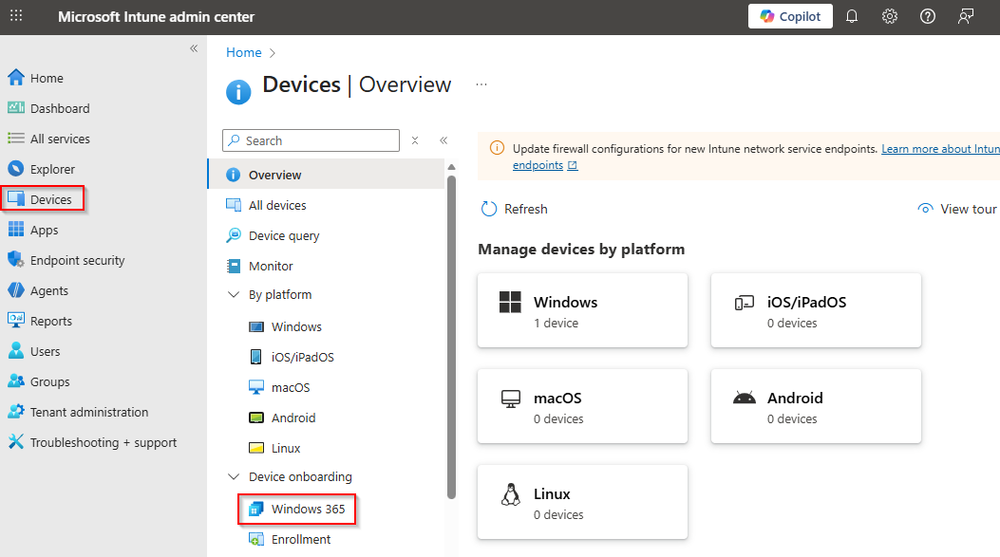

2.  In the **Windows 365 management panal** select **Provisioning Policy** and select **+ Create policy**.

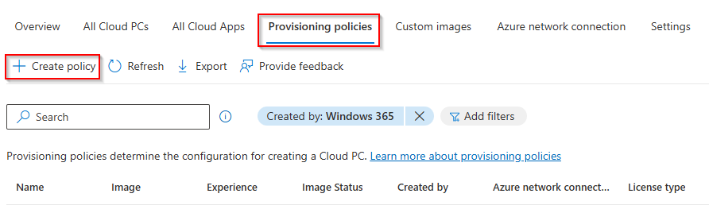

3.  On the **General** tab, make the following settings:

| Setting         | Value    | 
|--------------|-----------|
| Name | Select a name for your provisioning policy, e.g. **PP-P0-W365-Frontline-Shared-Desktop**      |
| Experience    | **Access a full Cloud PC desktop** |
| License type    | **Frontline** |
| Frontline type    | **Shared** |
| Join type | **Microsoft Entra Join** |
| Network    | **Microsoft hosted network** |
| Geography  | **European Union** |
| Use Microsoft Entra single sign-on | **Enabled** |

And then click **Next**.

4. Select the **latest Windows 11 Enterprise + Microsoft 365** image and click **Next**

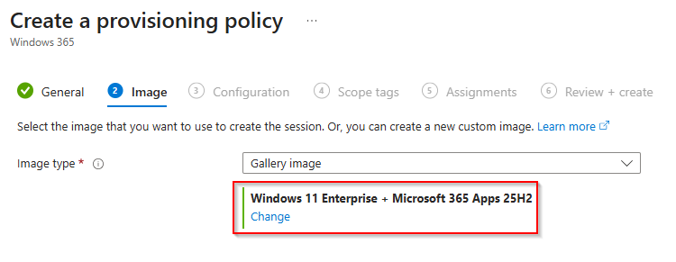

5. On the **Configuration** tab, under **Language & Region**, you can change the default language of your Cloud PCs during the provisioning process. This can be manually (via Windows update policies in Microsoft Intune) or via the Autopatch service.

>**Note**: If you select a language pack other than English, the provisioning of Cloud PCs will take longer. 

Under **Cloud PC naming** please activate the option **Apply device name template** so that you can use an individual Cloud PC device name for your users. Enter a **name template**, e.g. **CPCP0-%RAND:9%**.

For additional services select **None** and click **Next**.

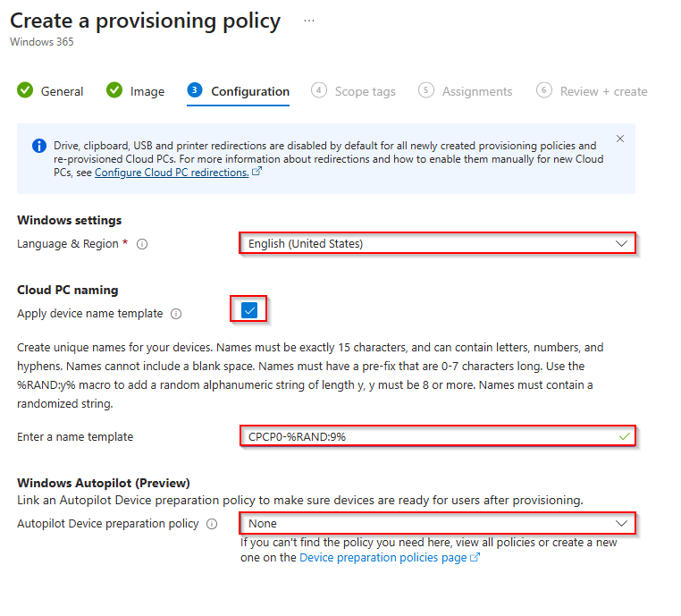

6. You can skip the **Scope tags** tab and continue with the **Assignments** user group. Click **Add groups** and search for your user group, e.g. **GRP-P1-Users** and click **select**. 

With W365 Frontline, you must select the Cloud PC size here under **Select one**.

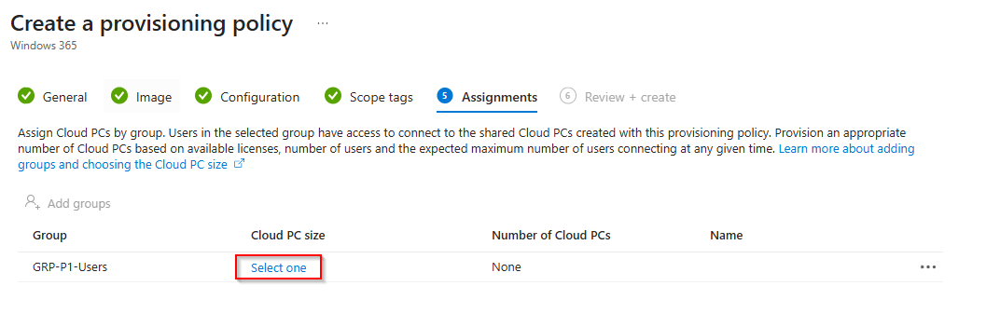

7. Select an available Cloud PC SKU from the list, enter an assignment name, such as **P0 Frontline Desktop**, and enter the number of Cloud PCs as **1**. 

> **Note:** Each participant has only **ONE** Windows 365 Frontline license. One license means one cloud PC. 

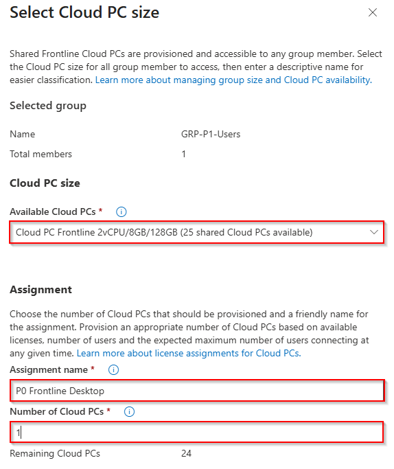

Click **Select** and **Next**.

8. In the last step, review the settings and click on **Create**. 

You should then see under **All Cloud PCs** that the provisioning of the Cloud PC has been started. 

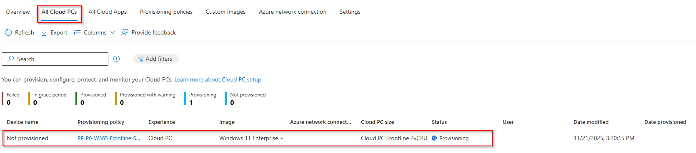

> **Note**: Provisioning a Cloud PC takes around 25-35 minutes and depends on the current queue, region and language configuration.

9. Once your Frontline Cloud PC has been successfully created and you can log in with the [**Windows App Web Client**](https://windows365.microsoft.com/ent) or the native **Windows App** and then open **Devices**.

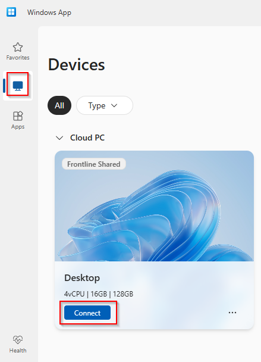

Click **Connect** to connect to your Cloud PC.  

## Solutionguide: Option 2 - Windows 365 Frontline Shared in Cloud Apps mode

1.  Sign in to the [Microsoft Intune](https://intune.microsoft.com/) and navigate to **Devices** then **Windows 365** to access the Windows 365 management panel.

2.  In the **Windows 365 management panal** select **Provisioning Policy** and select **+ Create policy**.

3.  On the **General** tab, make the following settings:

| Setting         | Value    |
|--------------|-----------|
| Name | Select a name for your provisioning policy, e.g. **PP-P0-W365-Frontline-Shared-Apps**      |
| Experience    | **Access only apps which run on a Cloud PC** |
| Join type | **Microsoft Entra Join** |
| Network    | **Microsoft hosted network** |
| Geography  | **European Union** |
| Use Microsoft Entra single sign-on | **Enabled** |

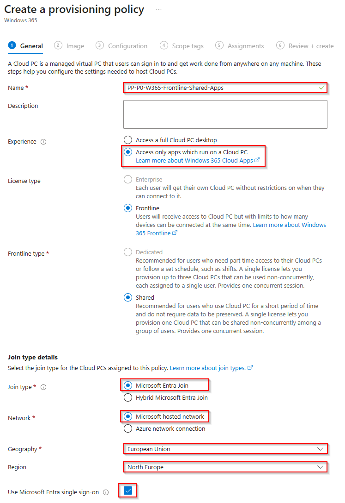

And then click **Next**.

4. Select the **latest Windows 11 Enterprise + Microsoft 365** image. If you want to see which apps are available on the image, click **View**. Otherwise, click **Next** to continue. 

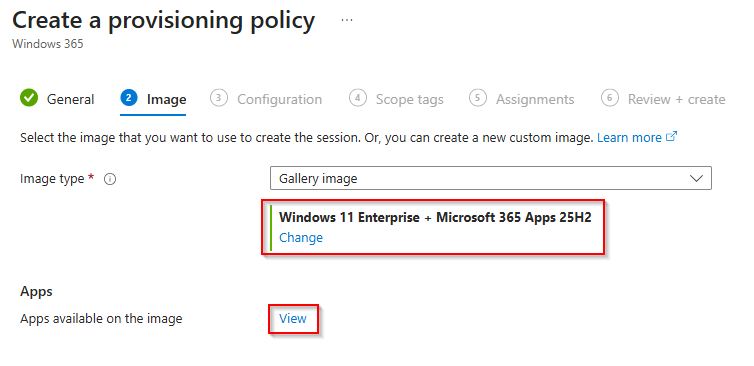

5. On the **Configuration** tab, under **Language & Region**, you can change the default language of your Cloud PCs during the provisioning process. This can be manually (via Windows update policies in Microsoft Intune) or via the Autopatch service.

>**Note**: If you select a language pack other than English, the provisioning of Cloud PCs will take longer. 

Under **Cloud PC naming** please activate the option **Apply device name template** so that you can use an individual Cloud PC device name for your users. Enter a **name template**, e.g. **CPCP0-%RAND:9%**.

For additional services select **None** and click **Next**.

6. You can skip the **Scope tags** tab and continue with the **Assignments** user group. Click **Add groups** and search for your user group, e.g. **GRP-P1-Users** and click **select**. 

With W365 Frontline, you must select the Cloud PC size here under **Select one**.

7. Select an available Cloud PC SKU from the list, enter an assignment name, such as **P0 Frontline Desktop**, and enter the number of Cloud PCs as **1**. 

> **Note:** Each participant has only **ONE** Windows 365 Frontline license. One license means one cloud PC. 

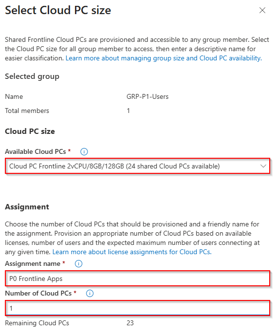

Click **Select** and **Next**.

8. In the last step, review the settings and click on **Create**. 

You should then see under **All Cloud PCs** that the provisioning of the Cloud PC has been started. 

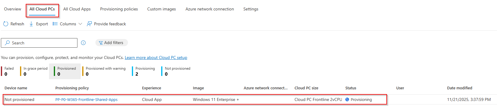

> **Note**: Provisioning a Cloud PC takes around 25-35 minutes and depends on the current queue, region and language configuration.

9. Once your Frontline Cloud PC has been successfully created, you can now publish some cloud apps under **All Cloud Apps**. 

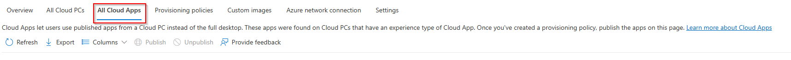

10. Select the apps you want to publish as cloud apps from the list, such as **Word or Microsoft Edge**, and then click **Publish**. 

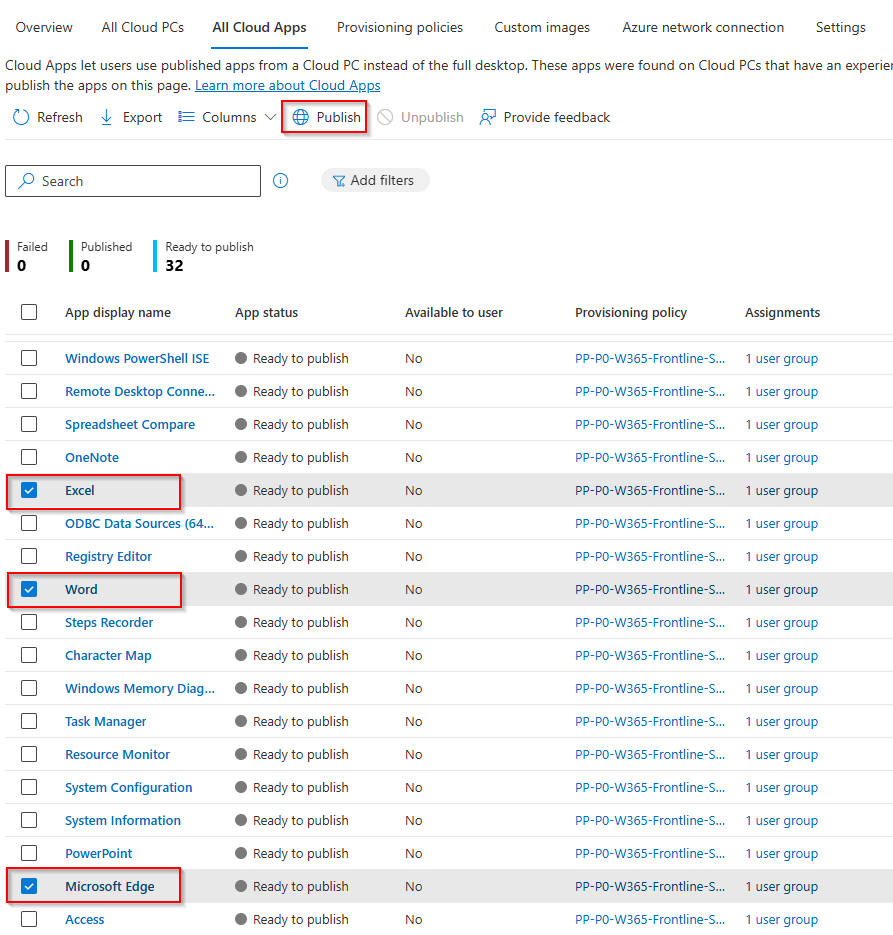

After a few minutes, the apps should appear with the app status **Published**. 

11. You can log in with the [**Windows App Web Client**](https://windows365.microsoft.com/ent) or the native **Windows App** and then open **Apps** to view all your published cloud apps.

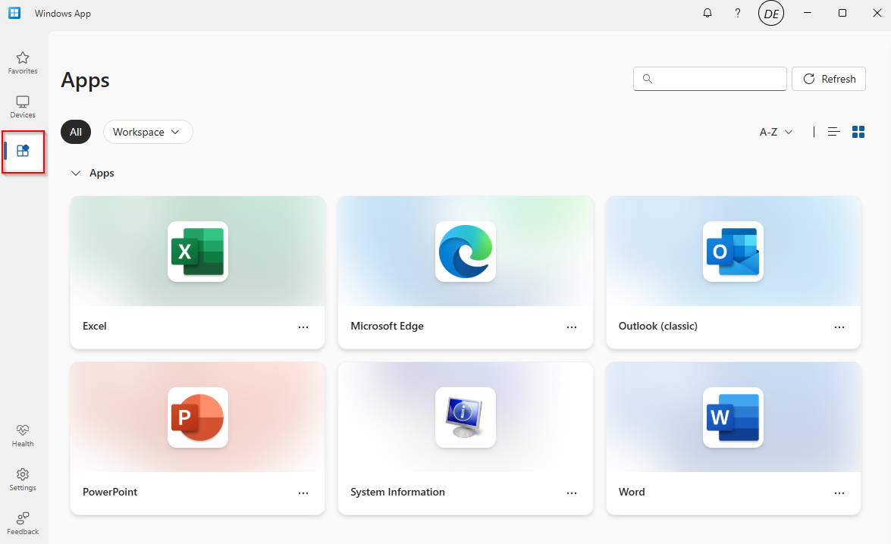

12. Now try Windows 365 Frontline in shared mode from Cloud Apps.